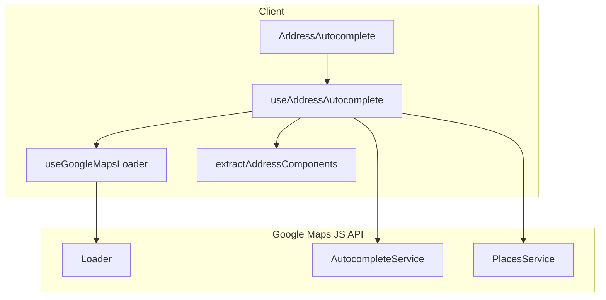

# Client-Side Google Maps Address Autocomplete

## Current State

- **Customer form** uses `AddressAutocomplete` which calls backend `/location/autocomplete` and `/location/details`
- **Property form** uses a plain `Textarea` for address (no autocomplete)
- `NEXT_PUBLIC_GOOGLE_MAPS_API_KEY` exists in [apps/web/lib/config/config.ts](apps/web/lib/config/config.ts) but is unused for autocomplete
- `@googlemaps/js-api-loader` is **not** installed

## Architecture



## Implementation Plan

### 1. Add dependency and env

- Install `@googlemaps/js-api-loader` in the workspace root
- Ensure `NEXT_PUBLIC_GOOGLE_MAPS_API_KEY` is documented in `.env.example` (or equivalent) for the web app

### 2. Create Google Maps loader hook (client-side only)

**New file:** `apps/web/lib/hooks/use-google-maps-loader.ts`

- Load Google Maps script via `Loader` from `@googlemaps/js-api-loader` inside `useEffect`
- Use `importLibrary('places')` to load Places library
- Singleton pattern: track loader instance in a module-level variable to prevent multiple script loads
- Return `{ isLoaded, error, places }` where `places` is the loaded namespace (or `null` until ready)
- Read API key from `config.thirdParty.googleMapsApiKey` (uses `NEXT_PUBLIC_GOOGLE_MAPS_API_KEY`)
- Guard: if no API key, return early with `error` and no loader

### 3. Create address extraction utility

**New file:** `apps/web/lib/utils/address-utils.ts`

- Parse `google.maps.places.PlaceResult` into `PlaceDetails`:

```ts
interface PlaceDetails {
  address: string;
  city: string;
  state: string;
  pincode: string;
  country: string;
  lat: number | null;
  lng: number | null;
}
```

- Extract from `address_components` array using types:
  - `street_number` + `route` → address
  - `locality` or `sublocality` → city
  - `administrative_area_level_1` → state
  - `postal_code` → pincode
  - `country` → country
- Fallback to `formatted_address` when components are missing
- Handle null/undefined place data safely

### 4. Rewrite useAddressAutocomplete hook

**File:** [apps/web/components/features/customers/hooks/use-address-autocomplete.ts](apps/web/components/features/customers/hooks/use-address-autocomplete.ts)

- Remove `apiClient` and backend calls
- Use `useGoogleMapsLoader` to get `places` namespace
- When `places` is loaded and `debouncedInput.length >= 3`:
  - Use `AutocompleteService.getPlacePredictions()` with `componentRestrictions: { country: 'in' }` (India)
  - Map predictions to `PlaceSuggestion`:
    - `place_id` → `placeId`
    - `structured_formatting.main_text` → `mainText`
    - `structured_formatting.secondary_text` → `secondaryText`
    - `description` → `description`
- `selectPlace(placeId)`:
  - Create `PlacesService` (requires a div or map; use a hidden div)
  - Call `getDetails({ placeId })` for `PlaceResult`
  - Use `extractAddressComponents()` to convert to `PlaceDetails`
- Return same interface: `{ suggestions, isLoading, isOpen, selectPlace, close }`
- Keep `PlaceSuggestion` and `PlaceDetails` types exported for reuse

### 5. Keep AddressAutocomplete component unchanged

**File:** [apps/web/components/features/customers/components/address-autocomplete.tsx](apps/web/components/features/customers/components/address-autocomplete.tsx)

- No changes to props or UI; it already uses `useAddressAutocomplete` and `PlaceDetails`
- Add optional handling when API key is missing: show a message or fallback to plain input

### 6. Integrate into property form

**File:** [apps/web/components/features/properties/components/property-form.tsx](apps/web/components/features/properties/components/property-form.tsx)

- Replace the address `Textarea` (lines 529–532) with `AddressAutocomplete`
- Use `Input`-style autocomplete (AddressAutocomplete uses Input) for consistency
- Wire `onPlaceSelect` to populate `address`, `city`, `state`, `pincode` (same pattern as customer form)

### 7. Optional: Backend removal

- The backend `LocationModule` and `/location/` endpoints can remain for other use cases (e.g. server-side geocoding) or be removed in a follow-up
- No changes to backend in this plan

## Key Files

| File                                                                         | Action                                     |
| ---------------------------------------------------------------------------- | ------------------------------------------ |
| `package.json`                                                               | Add `@googlemaps/js-api-loader`            |
| `apps/web/lib/hooks/use-google-maps-loader.ts`                               | New – loader hook                          |
| `apps/web/lib/utils/address-utils.ts`                                        | New – extract address components           |
| `apps/web/lib/hooks/index.ts`                                                | Export `useGoogleMapsLoader`               |
| `apps/web/components/features/customers/hooks/use-address-autocomplete.ts`   | Rewrite – replace backend with client-side |
| `apps/web/components/features/customers/components/address-autocomplete.tsx` | Minor – handle missing API key             |
| `apps/web/components/features/properties/components/property-form.tsx`       | Replace Textarea with AddressAutocomplete  |

## Technical Notes

- **Client-only:** `useGoogleMapsLoader` and `useAddressAutocomplete` run only in `useEffect` (client-side)
- **Script singleton:** One loader instance shared across components
- **PlacesService:** Requires a DOM element; use a hidden div or `document.createElement('div')`
- **Error handling:** Catch loader/API errors, set `error` state, avoid crashes on null place data
- **Performance:** Keep existing debounce (300ms) and min 3 chars; no extra re-renders
